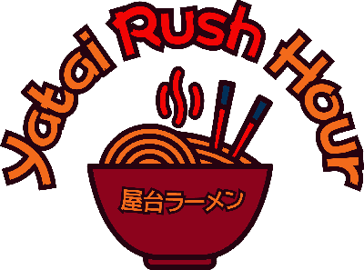

  
# Yatai_Rush_Hour
### Cook n' throw in Japan streets !
  
Jeu réalisé à l'occassion du défi Jabjob de fin d'année de L1 dans la licence JV du Cnam-Enjmin.
- Romain Lavidalie
- Jordan Burnet
- Emile Cometto
- Virgile Thiriot

Dans Yatai Rush Hour, revêtez le tablier d’un cuisinier travaillant dans une cuisine ambulante japonaise, le yatai. Votre objectif ? Répondre aux commandes de vos clients avant qu’ils ne perdent patience et leur envoyer au visage sans vous tromper de client. Soyez attentifs à la cuisson et aux ingrédients nécessaires à la bonne réalisation de vos ramens !
